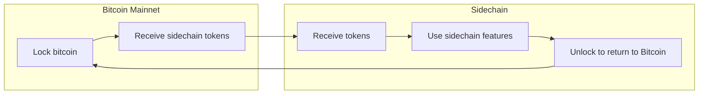

# Sidechains & Layer 2 Alternatives

Sidechains are separate blockchains that are pegged to Bitcoin, allowing bitcoin to be moved between the main chain and sidechain. They provide alternative scaling solutions and specialized features.

**Sidechains** are independent blockchains with their own consensus rules that are pegged to Bitcoin:



---

## Major Sidechains

### Liquid Network

**Liquid** is a federated sidechain:

```text
Features:
- Faster blocks (1 minute)
- Confidential transactions
- Asset issuance
- Federated consensus (functionaries)
```

**Use cases**:
- Exchange settlements
- Faster transactions
- Confidential amounts
- Tokenized assets

### Rootstock (RSK)

**Rootstock** is a smart contract sidechain:

```text
Features:
- EVM-compatible
- Smart contracts
- Merge mining with Bitcoin
- Two-way peg
```

**Use cases**:
- Smart contracts on Bitcoin
- DeFi applications
- Tokenization
- Complex contracts

---

## How Sidechains Work

### Two-Way Peg

```text
1. Lock bitcoin on mainnet
2. Wait for confirmation period
3. Receive tokens on sidechain
4. Use sidechain features
5. Lock tokens on sidechain
6. Wait for confirmation
7. Receive bitcoin on mainnet
```

### Peg Mechanisms

**Federated Peg**:
- Trusted functionaries
- Faster, but requires trust
- Used by Liquid

**SPV Peg**:
- Cryptographic proofs
- More trustless
- More complex

---

## Comparison with Lightning

| Feature | Sidechains | Lightning Network |
|---------|------------|-------------------|
| **Trust Model** | Varies (federated/SPV) | Trustless |
| **Speed** | Sidechain block time | Instant |
| **Features** | Custom consensus | Payment channels |
| **Complexity** | High | Medium |
| **Use Case** | Specialized features | Payments |

---

## Limitations

### Trust Requirements

- **Federated sidechains**: Require trust in functionaries
- **SPV sidechains**: More trustless but complex
- **Security**: Sidechain security separate from Bitcoin

### Trade-offs

- **Trust vs. Features**: More features often require more trust
- **Complexity**: More complex than Lightning
- **Adoption**: Limited compared to Lightning

---

## Related Topics

- [Lightning Network](/docs/lightning) - Payment channel network
- [Statechains](/docs/advanced/statechains) - Alternative approach
- [Governance](/docs/advanced/governance) - How Bitcoin evolves

---

## Resources

- [Liquid Network](https://liquid.net/)
- [Rootstock](https://www.rsk.co/)
