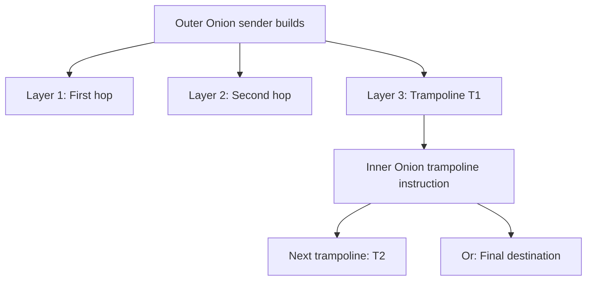
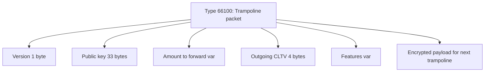

# Trampoline Routing

Trampoline routing allows lightweight Lightning clients to delegate pathfinding to intermediate nodes. Instead of computing the entire route, the sender specifies trampoline nodes that find the path to the destination.

## The Mobile Routing Problem

Standard Lightning routing requires:

1. Downloading the entire network graph (~100MB+)
2. Keeping the graph synchronized
3. Computing routes through thousands of nodes

**Problems for mobile**:
- Bandwidth: Downloading/syncing graph uses data
- Storage: Graph too large for some devices
- Battery: Graph sync and pathfinding drain power
- Time: Initial sync takes minutes

---

## How Trampoline Works

Instead of full pathfinding, the sender:

1. Picks one or more "trampoline nodes"
2. Creates an onion to the first trampoline
3. Tells the trampoline where to forward (next trampoline or destination)
4. Trampoline computes the actual route

```text
Standard Routing:
Sender → A → B → C → D → Recipient
(Sender knows entire path)

Trampoline Routing:
Sender → T1 → [?] → T2 → [?] → Recipient
(Sender only knows trampolines, trampolines find actual hops)
```

---

## Architecture

### Two-Layer Onion

Trampoline uses nested onion routing:



Trampoline T1 receives: outer onion layer (decrypts), inner onion (trampoline payload), instructions "Forward to T2", then builds new outer onion: T1 → [...] → T2.

### Payment Flow

```text
1. Sender builds outer onion to T1
   - Contains inner onion with "forward to Recipient via T2"
   
2. T1 receives, decrypts outer layer
   - Reads inner onion: "forward to T2"
   - Computes route: T1 → X → Y → T2
   - Builds new outer onion for X → Y → T2
   - Includes inner onion for T2

3. T2 receives, decrypts
   - Reads inner onion: "deliver to Recipient"
   - Computes route: T2 → Z → Recipient
   - Builds final outer onion

4. Recipient receives payment
```

---

## Privacy Trade-offs

### What Trampolines Learn

| Information | Standard | Trampoline |
|-------------|----------|------------|
| Sender identity | Hidden | Hidden from T2+, known to T1 |
| Recipient identity | Hidden | Known to final trampoline |
| Payment amount | Partial | Yes (for fee calculation) |
| Route length | Hidden | Partially visible |

### Privacy Considerations

**Reduced sender privacy**:
- First trampoline knows you're the sender
- Uses your channel to them as first hop

**Reduced recipient privacy**:
- Final trampoline knows the destination
- May learn payment patterns

**Mitigation**:
- Use multiple trampolines
- Rotate trampoline selection
- Add dummy hops

---

## Implementation

### Feature Bits

Trampoline support advertised via:

| Bit | Name | Description |
|-----|------|-------------|
| 56/57 | trampoline_routing | Trampoline node support |

### TLV Payload

Trampoline data in inner onion:



### Fee Handling

Trampolines charge for:
- Their routing services
- The actual route fees (which they pay)

```text
Sender pays: sender_fee + T1_fee + T2_fee + route_fees
T1 pays: route fees to T2
T2 pays: route fees to recipient
```

---

## Use Cases

### Mobile Wallets

Primary use case:

```text
Mobile App:
- No graph storage needed
- Instant payments (no route calculation)
- Lower bandwidth usage
- Better battery life
```

### Hardware Wallets

Limited devices benefit from delegation:

```text
Hardware Wallet:
- Limited processing power
- Small storage
- Delegate heavy computation to trampoline
```

### Constrained Environments

IoT and embedded devices:

```text
IoT Device:
- Minimal resources
- Pay via trampoline
- No graph maintenance
```

---

## Current Support

### Phoenix Wallet (ACINQ)

Primary trampoline implementation:

- Uses ACINQ nodes as trampolines
- Fully mobile-optimized
- No graph download required

### Eclair

ACINQ's node implementation supports trampoline.

### LND/CLN

Limited or experimental support as of 2024.

---

## Comparison

| Aspect | Standard | Trampoline |
|--------|----------|------------|
| Graph needed | Yes (~100MB) | No |
| Pathfinding | Client | Trampoline node |
| Privacy | Maximum | Reduced |
| Latency | Higher (compute) | Lower |
| Fees | Direct | + Trampoline fee |
| Mobile friendly | No | Yes |

---

## Security Considerations

### Trust in Trampolines

You trust trampolines to:
- Actually forward your payment
- Not charge excessive fees
- Maintain privacy (within limits)

**Mitigations**:
- Use reputable trampoline providers
- Specify max fees in payment
- Use multiple trampolines for larger payments

### Probing Attacks

Trampolines could:
- Probe to learn channel balances
- Correlate payments across users

**Mitigations**:
- Trampoline rotation
- Payment splitting
- Multiple trampoline chains

---

## Multi-Trampoline Routes

For better privacy and reliability:

```text
Single Trampoline:
Sender → T1 → [...] → Recipient
(T1 knows sender AND recipient)

Multi-Trampoline:
Sender → T1 → [...] → T2 → [...] → Recipient
(T1 knows sender, T2 knows recipient, neither knows both)
```

### Benefits

- **Better privacy**: No single node sees full picture
- **Redundancy**: Multiple routing options
- **Decentralization**: Not dependent on single provider

---

## Fee Structure

Trampoline fees typically include:

```text
Base Fee: Fixed per-payment charge
Proportional: Percentage of amount
Route Budget: Max for underlying route

Example:
Payment: 100,000 sats
Trampoline base: 1,000 msat
Trampoline proportional: 0.1%
Route budget: 500 sats max

Total max: 1 sat + 100 sats + 500 sats = 601 sats
```

---

## Future Developments

### BOLT12 Integration

Trampoline may integrate with offers:

- Recipient specifies preferred trampolines
- Automatic trampoline selection
- Better privacy through randomization

### Trampoline Networks

Potential for specialized trampoline networks:

- Competing trampoline providers
- Fee market for pathfinding
- Quality-of-service differentiation

---

## Summary

Trampoline routing provides:

- **Mobile optimization**: No graph sync needed
- **Delegated pathfinding**: Trampolines compute routes
- **Reduced bandwidth**: Minimal data requirements
- **Battery savings**: Less computation on device
- **Privacy trade-off**: Trampolines learn more than regular hops

---

## When to Use Trampoline

**Good fit**:
- Mobile wallets
- Hardware wallets
- Constrained devices
- Casual users prioritizing convenience

**Poor fit**:
- Privacy-focused users
- Routing nodes
- When you need full control over route selection

---

## Related Topics

- [Onion Routing](/docs/lightning/onion) - Privacy-preserving routing
- [Routing & HTLCs](/docs/lightning/routing) - Standard routing mechanics

---

## Resources

- [Trampoline Routing Proposal](https://github.com/lightning/bolts/pull/829)
- [ACINQ Trampoline Blog](https://medium.com/@ACINQ/introducing-phoenix-5c5cc76c7f9e)
- [Phoenix Wallet](https://phoenix.acinq.co/) - Trampoline-based wallet
