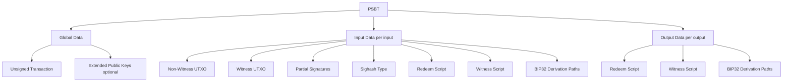
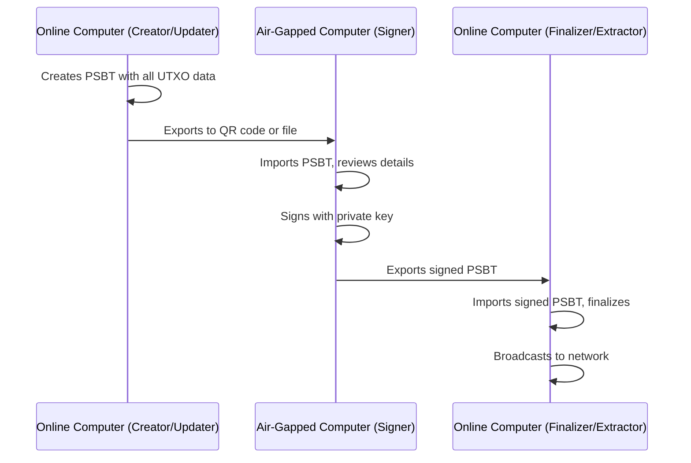

# Partially Signed Bitcoin Transactions (PSBT)

PSBTs (BIP-174) provide a standardized format for passing unsigned or partially signed transactions between different software and hardware. They're essential for multi-party signing, hardware wallet integration, and air-gapped setups. Before PSBT, passing transactions between wallets was ad-hoc: each wallet had its own format, hardware wallets needed custom integrations, multi-signature coordination was complex, and there was no standard way to include signing metadata. PSBT provides: **Standardized Format** (all wallets speak the same language), **Metadata Inclusion** (UTXOs, scripts, derivation paths), **Partial Signatures** (multiple parties can sign independently), and **Hardware Wallet Support** (works with air-gapped devices). PSBTs let multiple parties contribute to a transaction without sharing private keys, fitting the [trust model](/docs/fundamentals/trust-model) (minimize trust in intermediaries). They are the standard way to coordinate [transaction construction](/docs/bitcoin-development/transactions) across wallets, hardware signers, and air-gapped setups.

---

## PSBT Structure

### Components



### Roles in PSBT Workflow

1. **Creator**: Creates the unsigned transaction
2. **Updater**: Adds UTXO information and scripts
3. **Signer**: Adds signatures
4. **Combiner**: Merges multiple PSBTs
5. **Finalizer**: Completes the transaction
6. **Extractor**: Extracts the final transaction

---

## Creating PSBTs

### Using Bitcoin Core

```bash
# Create a PSBT
bitcoin-cli walletcreatefundedpsbt \
  '[]' \
  '[{"bc1q...address...": 0.5}]' \
  0 \
  '{"includeWatching": true}'

# Result: {"psbt": "cHNidP8BAH0CAAAA...", "fee": 0.00001410, "changepos": 1}
```

### Creating PSBTs in Code

:::code-group
```rust
use bitcoin::psbt::Psbt;
use bitcoin::{Transaction, TxIn, TxOut, OutPoint, Sequence};

let tx = Transaction {
    version: 2,
    lock_time: bitcoin::absolute::LockTime::ZERO,
    input: vec![TxIn {
        previous_output: OutPoint::new(prev_txid, 0),
        script_sig: bitcoin::ScriptBuf::new(),
        sequence: Sequence::ENABLE_RBF_NO_LOCKTIME,
        witness: bitcoin::Witness::default(),
    }],
    output: vec![TxOut { value: Amount::from_sat(50000), script_pubkey: recipient_script }],
};
let mut psbt = Psbt::from_unsigned_tx(tx)?;
psbt.inputs[0].witness_utxo = Some(TxOut { value: Amount::from_sat(100000), script_pubkey: input_script });
```

```python
from bitcoin.psbt import PSBT
from bitcoin.core import CTransaction, CTxIn, CTxOut, COutPoint

tx = CTransaction([CTxIn(COutPoint(prev_txid, 0))], [CTxOut(50000, recipient_script)])
psbt = PSBT(tx)
psbt.inputs[0].witness_utxo = CTxOut(100000, input_script)
psbt_bytes = psbt.serialize()
```

```cpp
// libbitcoin has limited PSBT support
// Consider using bitcoin-cli or implementing BIP-174 manually
// See: https://github.com/bitcoin/bips/blob/master/bip-0174.mediawiki
```

```go
package main

import (
	"encoding/hex"
	"fmt"

	"github.com/btcsuite/btcd/btcutil"
	"github.com/btcsuite/btcd/chaincfg"
	"github.com/btcsuite/btcd/txscript"
	"github.com/btcsuite/btcd/wire"
)

func createPSBT(prevTxid string, recipientAddr string, inputValue int64) (*wire.MsgTx, error) {
	// Create transaction
	tx := wire.NewMsgTx(wire.TxVersion)

	// Add input
	prevTxHash, err := wire.NewHashFromStr(prevTxid)
	if err != nil {
		return nil, err
	}
	txIn := wire.NewTxIn(wire.NewOutPoint(prevTxHash, 0), nil, nil)
	tx.AddTxIn(txIn)

	// Add output
	addr, err := btcutil.DecodeAddress(recipientAddr, &chaincfg.MainNetParams)
	if err != nil {
		return nil, err
	}
	script, err := txscript.PayToAddrScript(addr)
	if err != nil {
		return nil, err
	}
	txOut := wire.NewTxOut(50000, script)
	tx.AddTxOut(txOut)

	// In a real implementation, you would serialize this as a PSBT
	// using BIP-174 format
	return tx, nil
}

func main() {
	tx, err := createPSBT("previous_txid_here", "bc1q...", 100000)
	if err != nil {
		panic(err)
	}
	fmt.Printf("Transaction created with %d inputs and %d outputs\n", len(tx.TxIn), len(tx.TxOut))
}
```

```javascript
import * as bitcoin from 'bitcoinjs-lib';

const psbt = new bitcoin.Psbt({ network: bitcoin.networks.bitcoin });
psbt.addInput({
  hash: 'previous_txid_here',
  index: 0,
  witnessUtxo: { script: Buffer.from('0014...', 'hex'), value: 100000 },
});
psbt.addOutput({ address: 'bc1q...', value: 50000 });
const psbtBase64 = psbt.toBase64();
```
:::

---

## Signing PSBTs

### Single Signature

```typescript
// Using bitcoinjs-lib
import ECPairFactory from 'ecpair';
import * as ecc from 'tiny-secp256k1';

const ECPair = ECPairFactory(ecc);

// Parse PSBT
const psbt = Psbt.fromBase64(psbtBase64);

// Create key pair
const keyPair = ECPair.fromWIF(privateKeyWIF);

// Sign input 0
psbt.signInput(0, keyPair);

// Check if fully signed
if (psbt.validateSignaturesOfInput(0, validator)) {
  // Finalize the input
  psbt.finalizeInput(0);
}

// Export signed PSBT
const signedPsbt = psbt.toBase64();
```

### Hardware Wallet Signing

```typescript
// Example with Ledger
import TransportWebUSB from '@ledgerhq/hw-transport-webusb';
import AppBtc from '@ledgerhq/hw-app-btc';

async function signWithLedger(psbtBase64: string) {
  // Connect to Ledger
  const transport = await TransportWebUSB.create();
  const btc = new AppBtc({ transport });
  
  // Parse PSBT
  const psbt = Psbt.fromBase64(psbtBase64);
  
  // Get the serialized PSBT for Ledger
  const psbtHex = psbt.toHex();
  
  // Sign with Ledger (simplified)
  // Actual implementation depends on Ledger app version
  const signature = await btc.signMessage(
    "84'/0'/0'/0/0",
    psbtHex
  );
  
  return signature;
}
```

### Multi-Signature Signing

```typescript
// Create PSBT for 2-of-3 multisig
const psbt = new Psbt();

psbt.addInput({
  hash: txid,
  index: 0,
  witnessUtxo: {
    script: p2wshScript,
    value: 100000,
  },
  witnessScript: multisigScript, // The actual multisig script
});

psbt.addOutput({
  address: 'bc1q...',
  value: 50000,
});

// First signer signs
psbt.signInput(0, keyPair1);

// Export partially signed PSBT
const partiallySignedPsbt = psbt.toBase64();

// --- Send to second signer ---

// Second signer imports and signs
const psbt2 = Psbt.fromBase64(partiallySignedPsbt);
psbt2.signInput(0, keyPair2);

// Now we have 2-of-3 signatures, can finalize
psbt2.finalizeInput(0);

// Extract final transaction
const finalTx = psbt2.extractTransaction();
console.log(finalTx.toHex());
```

---

## Combining PSBTs

When multiple parties sign the same PSBT independently:

```typescript
// Party A signs
const psbtA = Psbt.fromBase64(originalPsbt);
psbtA.signInput(0, keyPairA);
const signedA = psbtA.toBase64();

// Party B signs (independently)
const psbtB = Psbt.fromBase64(originalPsbt);
psbtB.signInput(0, keyPairB);
const signedB = psbtB.toBase64();

// Combine the PSBTs
const combined = Psbt.fromBase64(signedA);
const psbtBParsed = Psbt.fromBase64(signedB);

combined.combine(psbtBParsed);

// Now combined has both signatures
combined.finalizeAllInputs();
const finalTx = combined.extractTransaction();
```

### Using Bitcoin Core

```bash
# Combine multiple PSBTs
bitcoin-cli combinepsbt '["psbt1_base64", "psbt2_base64"]'
```

---

## Finalizing PSBTs

### Manual Finalization

```typescript
const psbt = Psbt.fromBase64(signedPsbt);

// Finalize each input
for (let i = 0; i < psbt.inputCount; i++) {
  try {
    psbt.finalizeInput(i);
  } catch (e) {
    console.error(`Failed to finalize input ${i}:`, e);
  }
}

// Check if all inputs are finalized
if (psbt.data.inputs.every(input => input.finalScriptSig || input.finalScriptWitness)) {
  const tx = psbt.extractTransaction();
  console.log('Final transaction:', tx.toHex());
}
```

### Custom Finalizers

For complex scripts, you may need custom finalizers:

```typescript
psbt.finalizeInput(0, (inputIndex, input, script) => {
  // Custom finalization logic for complex scripts
  const payment = bitcoin.payments.p2wsh({
    redeem: {
      input: bitcoin.script.compile([
        input.partialSig[0].signature,
        input.partialSig[1].signature,
        bitcoin.opcodes.OP_TRUE, // For example, a conditional branch
      ]),
      output: input.witnessScript,
    },
  });
  
  return {
    finalScriptSig: Buffer.from([]),
    finalScriptWitness: payment.witness,
  };
});
```

---

## PSBT Workflow Examples

### Air-Gapped Signing



### CoinJoin with PSBT

```typescript
// Coordinator creates base transaction
const psbt = new Psbt();

// Add inputs from multiple participants
participants.forEach(participant => {
  psbt.addInput({
    hash: participant.utxo.txid,
    index: participant.utxo.vout,
    witnessUtxo: participant.utxo.witnessUtxo,
    bip32Derivation: participant.derivation,
  });
});

// Add outputs (equal amounts for anonymity)
participants.forEach(participant => {
  psbt.addOutput({
    address: participant.outputAddress,
    value: COINJOIN_AMOUNT,
  });
});

// Shuffle outputs for privacy
// ... shuffle logic ...

// Distribute to participants for signing
const psbtBase64 = psbt.toBase64();

// Each participant signs their input
// Coordinator combines and broadcasts
```

---

## PSBT Version 2 (BIP-370)

PSBT v2 introduces improvements for interactive protocols:

### Key Differences

| Feature | PSBT v0 | PSBT v2 |
|---------|---------|---------|
| Transaction Storage | Global | Reconstructed from fields |
| Modifiable | No | Yes (with restrictions) |
| Lock Time | Fixed | Per-input |
| Use Case | Simple signing | Interactive protocols |

### When to Use PSBT v2

- CoinJoin protocols
- Payjoin
- Multi-round signing protocols
- Interactive transaction construction

---

## Error Handling

### Common PSBT Errors

```typescript
try {
  const psbt = Psbt.fromBase64(psbtString);
} catch (e) {
  if (e.message.includes('Invalid PSBT magic')) {
    console.error('Not a valid PSBT');
  } else if (e.message.includes('Duplicate key')) {
    console.error('PSBT contains duplicate data');
  }
}

// Validation before signing
try {
  psbt.signInput(0, keyPair);
} catch (e) {
  if (e.message.includes('No inputs found')) {
    console.error('PSBT has no inputs');
  } else if (e.message.includes('Need UTXO')) {
    console.error('Missing UTXO data for input');
  }
}
```

### Validation Checks

```typescript
function validatePsbt(psbt: Psbt): boolean {
  // Check all inputs have required data
  for (let i = 0; i < psbt.inputCount; i++) {
    const input = psbt.data.inputs[i];
    
    // Need either witness UTXO or non-witness UTXO
    if (!input.witnessUtxo && !input.nonWitnessUtxo) {
      console.error(`Input ${i} missing UTXO data`);
      return false;
    }
    
    // For non-SegWit, need full previous transaction
    if (input.nonWitnessUtxo && !input.witnessUtxo) {
      // Verify the UTXO matches the referenced output
      const prevTx = bitcoin.Transaction.fromBuffer(input.nonWitnessUtxo);
      const prevOut = psbt.txInputs[i];
      if (prevTx.getId() !== prevOut.hash.reverse().toString('hex')) {
        console.error(`Input ${i} UTXO doesn't match`);
        return false;
      }
    }
  }
  
  return true;
}
```

---

## Best Practices

### For PSBT Creators

1. **Include All Metadata**: Add derivation paths, scripts, and UTXOs
2. **Use Deterministic Inputs**: Order inputs consistently
3. **Set Appropriate Sighash**: Default to SIGHASH_ALL
4. **Validate Before Export**: Check PSBT is well-formed

### For PSBT Signers

1. **Verify Outputs**: Always review destination and amounts
2. **Check Change Address**: Verify change goes to your wallet
3. **Inspect Fee**: Ensure fee is reasonable
4. **Validate Scripts**: For complex scripts, verify the spending conditions

### For Hardware Wallet Integration

1. **Include BIP32 Paths**: Hardware wallets need derivation info
2. **Use Standard Paths**: Stick to BIP44/49/84/86 paths
3. **Test on Testnet**: Always test the integration first
4. **Handle Rejections**: User may reject on device

---

## Summary

PSBTs provide a standardized way to:

- **Create** unsigned transactions with full metadata
- **Update** with UTXO and script information
- **Sign** with one or multiple parties
- **Combine** signatures from different sources
- **Finalize** and extract broadcast-ready transactions

Understanding PSBTs is essential for modern Bitcoin development, especially when working with hardware wallets, multi-signature setups, or any multi-party transaction construction.

---

## Related Topics

- [Transaction Construction](/docs/bitcoin-development/transactions) - Building transactions from scratch
- [Key Management](/docs/bitcoin-development/keys) - Managing signing keys
- [Address Generation](/docs/bitcoin-development/addresses) - Creating and validating addresses
- [Multisig](/docs/wallets/multisig) - Multi-signature wallet setups
