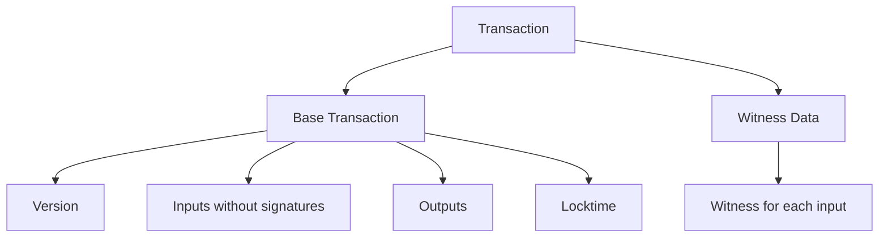
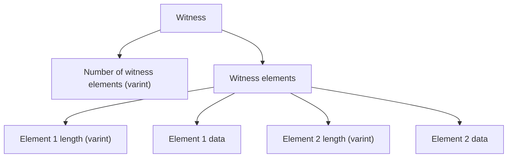
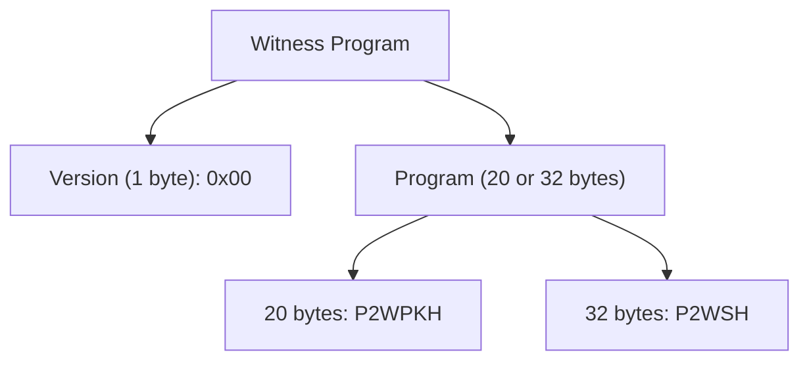

# Segregated Witness (SegWit)

Segregated Witness (SegWit) is a major Bitcoin protocol upgrade activated in August 2017 (block 481,824). It separates signature (witness) data from transaction data, fixing transaction malleability and effectively increasing block capacity. SegWit was designed primarily by [Pieter Wuille](/docs/history/people#pieter-wuille) (BIP 141). **SegWit** separates the "witness" (signature data) from the transaction body, storing it in a separate structure. This fundamental change enables:

- **Malleability fix**: Transaction IDs can no longer be changed after signing
- **Capacity increase**: Effective block size up to ~4 MB (from 1 MB)
- **Fee reduction**: Witness data costs less than transaction data
- **Lightning Network**: Enables payment channels and off-chain scaling

---

## The Problem SegWit Solved

### Transaction Malleability

Before SegWit, anyone could modify a transaction's signature without invalidating it, changing the transaction ID:

```text
Original Transaction:
TXID: abc123...

Modified (malleated) Transaction:
TXID: def456... (different ID, same validity)
```

**Impact**: 
- Made it impossible to build transactions that depend on unconfirmed transactions
- Blocked development of payment channels (Lightning Network)
- Created uncertainty in transaction tracking

### Block Size Limit

The 1 MB block size limit created congestion:

```text
Before SegWit:
- Block size: 1 MB maximum
- Transactions per block: ~2,000-3,000
- Network capacity: ~7 transactions/second
```

---

## How SegWit Works

### Transaction Structure

SegWit transactions have two parts:



### Witness Structure

Each input can have witness data:



### Weight Units

SegWit introduced **weight units** instead of bytes:

```text
Weight = (Base Size × 4) + Total Size

Where:
- Base Size: Transaction without witness data
- Total Size: Transaction with witness data
- Block limit: 4,000,000 weight units
```

**Effective capacity**:
- Non-SegWit: ~1 MB per block
- All SegWit: ~2-4 MB per block (depending on witness ratio)

---

## Address Types

### P2WPKH (Pay-to-Witness-Pubkey-Hash)

Native SegWit addresses starting with `bc1q`:

```text
Format: bc1q + 32 characters
Example: bc1qw508d6qejxtdg4y5r3zarvary0c5xw7kv8f3t4
```

### P2WSH (Pay-to-Witness-Script-Hash)

SegWit version of P2SH for complex scripts:

```text
Format: bc1q + 32 characters (longer)
Example: bc1qrp33g0q5c5txsp9arysrx4k6zdkfs4nce4xj0gdcccefvpysxf3qccfmv3
```

### P2SH-P2WPKH (Nested SegWit)

Wrapped SegWit for backward compatibility:

```text
Format: Starts with '3' (like P2SH)
Example: 3J98t1WpEZ73CNmQviecrnyiWrnqRhWNLy
```

---

## Code Examples

### Creating a SegWit Transaction

:::code-group
```rust
use bitcoin::{Address, Network, Script, Transaction, TxIn, TxOut, Witness};
use bitcoin::hashes::Hash;
use bitcoin::secp256k1::{Secp256k1, SecretKey};

fn create_segwit_transaction(
    inputs: Vec<TxIn>,
    outputs: Vec<TxOut>,
    witness_data: Vec<Witness>,
) -> Transaction {
    let mut tx = Transaction {
        version: 2,
        lock_time: bitcoin::locktime::absolute::LockTime::ZERO,
        input: inputs,
        output: outputs,
    };
    
    // Add witness data
    for (i, witness) in witness_data.into_iter().enumerate() {
        tx.input[i].witness = witness;
    }
    
    tx
}

fn create_p2wpkh_witness(signature: Vec<u8>, pubkey: Vec<u8>) -> Witness {
    let mut witness = Witness::new();
    witness.push(signature);
    witness.push(pubkey);
    witness
}
```

```python
from bitcoin import SelectParams
from bitcoin.core import CTransaction, CTxIn, CTxOut, CTxWitness
from bitcoin.core.script import CScript

def create_segwit_transaction(inputs, outputs, witness_data):
    """Create a SegWit transaction."""
    tx = CTransaction()
    tx.vin = inputs
    tx.vout = outputs
    tx.nVersion = 2
    tx.nLockTime = 0
    
    # Add witness data
    tx.wit = CTxWitness()
    for witness in witness_data:
        tx.wit.vtxinwit.append(witness)
    
    return tx

def create_p2wpkh_witness(signature, pubkey):
    """Create witness for P2WPKH spend."""
    witness = CTxWitness()
    witness.stack = [signature, pubkey]
    return witness
```

```cpp
#include <bitcoin/bitcoin.hpp>

bc::transaction create_segwit_transaction(
    const std::vector<bc::input>& inputs,
    const std::vector<bc::output>& outputs,
    const std::vector<bc::witness>& witnesses
) {
    bc::transaction tx;
    tx.set_version(2);
    tx.set_locktime(0);
    tx.set_inputs(inputs);
    tx.set_outputs(outputs);
    
    // Add witness data
    for (size_t i = 0; i < witnesses.size() && i < inputs.size(); ++i) {
        tx.inputs()[i].set_witness(witnesses[i]);
    }
    
    return tx;
}

bc::witness create_p2wpkh_witness(
    const bc::ec_signature& signature,
    const bc::ec_compressed& pubkey
) {
    bc::witness witness;
    witness.push_back(bc::to_chunk(signature));
    witness.push_back(bc::to_chunk(pubkey));
    return witness;
}
```

```go
package main

import (
	"github.com/btcsuite/btcd/wire"
	"github.com/btcsuite/btcd/btcutil"
)

func createSegWitTransaction(
	inputs []*wire.TxIn,
	outputs []*wire.TxOut,
	witnessData [][]wire.TxWitness,
) *wire.MsgTx {
	tx := wire.NewMsgTx(wire.TxVersion)
	tx.LockTime = 0
	
	for _, input := range inputs {
		tx.AddTxIn(input)
	}
	
	for _, output := range outputs {
		tx.AddTxOut(output)
	}
	
	// Add witness data
	for i, witness := range witnessData {
		if i < len(tx.TxIn) {
			tx.TxIn[i].Witness = witness
		}
	}
	
	return tx
}

func createP2WPKHWitness(signature, pubkey []byte) wire.TxWitness {
	return wire.TxWitness{signature, pubkey}
}
```

```javascript
const bitcoin = require('bitcoinjs-lib');

function createSegWitTransaction(inputs, outputs, witnessData) {
    const tx = new bitcoin.Transaction();
    tx.version = 2;
    tx.locktime = 0;
    
    // Add inputs
    inputs.forEach(input => {
        tx.addInput(input.hash, input.index, input.sequence);
    });
    
    // Add outputs
    outputs.forEach(output => {
        tx.addOutput(output.address, output.value);
    });
    
    // Add witness data
    witnessData.forEach((witness, i) => {
        if (i < tx.ins.length) {
            tx.ins[i].witness = witness;
        }
    });
    
    return tx;
}

function createP2WPKHWitness(signature, pubkey) {
    return [signature, pubkey];
}
```
:::

### Calculating Transaction Weight

:::code-group
```rust
fn calculate_weight(tx: &Transaction) -> usize {
    let base_size = tx.get_size_without_witness();
    let total_size = tx.get_total_size();
    (base_size * 4) + total_size
}

fn calculate_vsize(tx: &Transaction) -> usize {
    let weight = calculate_weight(tx);
    (weight + 3) / 4  // Round up
}
```

```python
def calculate_weight(tx):
    """Calculate transaction weight."""
    base_size = len(tx.serialize_without_witness())
    total_size = len(tx.serialize())
    return (base_size * 4) + total_size

def calculate_vsize(tx):
    """Calculate virtual size (vbytes)."""
    weight = calculate_weight(tx)
    return (weight + 3) // 4  # Round up
```

```cpp
size_t calculate_weight(const bc::transaction& tx) {
    size_t base_size = tx.serialized_size(false);
    size_t total_size = tx.serialized_size(true);
    return (base_size * 4) + total_size;
}

size_t calculate_vsize(const bc::transaction& tx) {
    size_t weight = calculate_weight(tx);
    return (weight + 3) / 4;  // Round up
}
```

```go
func calculateWeight(tx *wire.MsgTx) int {
    baseSize := tx.SerializeSizeStripped()
    totalSize := tx.SerializeSize()
    return (baseSize * 4) + totalSize
}

func calculateVSize(tx *wire.MsgTx) int {
    weight := calculateWeight(tx)
    return (weight + 3) / 4  // Round up
}
```

```javascript
function calculateWeight(tx) {
    const baseSize = tx.byteLength(false);  // Without witness
    const totalSize = tx.byteLength(true);  // With witness
    return (baseSize * 4) + totalSize;
}

function calculateVSize(tx) {
    const weight = calculateWeight(tx);
    return Math.ceil(weight / 4);
}
```
:::

---

## Transaction ID vs. Witness Transaction ID

### Before SegWit

```text
TXID = SHA256D(serialized transaction)
```

Problem: Signature changes → TXID changes (malleability)

### After SegWit

```text
TXID = SHA256D(serialized transaction WITHOUT witness)
wtxid = SHA256D(serialized transaction WITH witness)
```

**Key insight**: TXID no longer includes witness data, so it can't be changed by signature modifications.

---

## Benefits

### 1. Malleability Fix

Transactions can now safely reference unconfirmed transactions:

```text
Before SegWit:
Parent TX: abc123... (unconfirmed)
Child TX: references abc123...
→ Parent gets malleated → def456...
→ Child TX becomes invalid!

After SegWit:
Parent TX: abc123... (TXID fixed, can't be changed)
Child TX: references abc123...
→ Always valid!
```

### 2. Effective Capacity Increase

```text
Block Weight Limit: 4,000,000 weight units

Example block:
- Base size: 1,000,000 bytes
- Witness size: 1,500,000 bytes
- Total size: 2,500,000 bytes
- Weight: (1,000,000 × 4) + 2,500,000 = 6,500,000 weight units

But wait... that's over the limit!

Actual calculation:
- Base: 1,000,000 bytes = 4,000,000 weight units
- Witness: 1,500,000 bytes = 1,500,000 weight units
- Total weight: 5,500,000 (over limit)

Realistic SegWit block:
- Base: 1,000,000 bytes = 4,000,000 weight units
- Witness: 1,000,000 bytes = 1,000,000 weight units
- Total: 5,000,000 weight units (over limit)

Optimal SegWit block:
- Base: 1,000,000 bytes = 4,000,000 weight units
- Witness: 0 bytes = 0 weight units
- Total: 4,000,000 weight units (at limit)

With mixed transactions:
- ~2-3 MB effective capacity
```

### 3. Fee Savings

Witness data costs 1/4 the weight of base data:

```text
Legacy transaction:
- 250 bytes total
- Fee: 250 bytes × fee_rate

SegWit transaction:
- 100 bytes base + 150 bytes witness
- Weight: (100 × 4) + 250 = 650 weight units
- Virtual size: 650 / 4 = 162.5 vbytes
- Fee: 162.5 vbytes × fee_rate (35% savings!)
```

---

## Adoption

### Current Usage

As of 2024:
- **~80% of transactions** use SegWit
- Most wallets support SegWit addresses
- Lightning Network requires SegWit

### Migration Path

1. **P2SH-P2WPKH** (wrapped): Backward compatible, starts with '3'
2. **P2WPKH** (native): Best efficiency, starts with 'bc1q'
3. **P2TR** (Taproot): Latest standard, starts with 'bc1p'

---

## Technical Details

### Witness Version

SegWit uses witness version 0:



### Script Execution

SegWit changes script execution:

1. **Old**: ScriptSig + ScriptPubKey executed together
2. **New**: Witness script replaces ScriptSig, ScriptPubKey is minimal

```text
P2WPKH ScriptPubKey:
OP_0 <20-byte hash>

Witness (replaces ScriptSig):
<signature> <pubkey>
```

---

## Related Topics

- [Taproot](/docs/bitcoin/taproot) - Next major upgrade after SegWit
- [Address Types](/docs/wallets/address-types) - Understanding SegWit addresses
- [Transaction Fees](/docs/bitcoin/transaction-fees) - How SegWit affects fees
- [Lightning Network](/docs/lightning) - Requires SegWit to function

---

## Resources

- [BIP 141: Segregated Witness](https://github.com/bitcoin/bips/blob/master/bip-0141.mediawiki)
- [BIP 143: Transaction Signature Verification](https://github.com/bitcoin/bips/blob/master/bip-0143.mediawiki)
- [BIP 144: Segregated Witness (Peer Services)](https://github.com/bitcoin/bips/blob/master/bip-0144.mediawiki)
