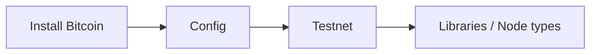

# Setup & Infrastructure

This section covers the setup and infrastructure needed for Bitcoin development: installing Bitcoin Core, testing and debugging, working with test networks, choosing libraries, understanding node architecture, and exploring Bitcoin Core internals.

> **Hands-on learning:** Try Bitcoin RPC commands directly in the [Bitcoin CLI Terminal](/terminal). No node setup required.

| Topic | Page |
|-------|------|
| Installing Bitcoin | [Install Bitcoin](/docs/development/install-bitcoin) |
| Testing & debugging | [Testing](/docs/development/testing) |
| Test networks (testnet, signet, regtest) | [Test Networks](/docs/development/testnets) |
| Libraries & SDKs | [Libraries](/docs/development/libraries) |
| Node types & architecture | [Node Types](/docs/development/node-types) |
| Bitcoin Core internals | [Bitcoin Core Internals](/docs/development/bitcoin-core-internals) |



## Programming Languages in Bitcoin

### C++ (Bitcoin Core)

The reference implementation of Bitcoin is written in C++.

**Used for:**
- Bitcoin Core development
- Performance-critical applications
- Protocol-level changes
- Consensus code

**Key libraries:**
- **libbitcoin**: Full-featured Bitcoin library
- **libsecp256k1**: Optimized elliptic curve library (used by Bitcoin Core)

**When to use:**
- Contributing to Bitcoin Core
- Building nodes or mining software
- Maximum performance requirements

```cpp
// Example: Creating a simple transaction hash
#include <bitcoin/bitcoin.hpp>

bc::hash_digest tx_hash = bc::bitcoin_hash(tx_data);
```

### Rust

Increasingly popular for Bitcoin development due to memory safety and performance.

**Used for:**
- Lightning implementations (LDK)
- Wallet libraries
- Cryptographic tools
- New protocol implementations

**Key libraries:**
- **rust-bitcoin**: Core Bitcoin data structures
- **rust-lightning (LDK)**: Lightning Development Kit
- **bdk (Bitcoin Dev Kit)**: Modern wallet library
- **rust-miniscript**: Policy to script compiler

**When to use:**
- New Bitcoin applications
- Security-critical code
- Modern wallet development
- Lightning applications

```rust
// Example: Creating a Bitcoin address
use bitcoin::{Address, Network, PublicKey};

let address = Address::p2pkh(&public_key, Network::Bitcoin);
```

### Python

Excellent for scripting, prototyping, and learning.

**Used for:**
- Rapid prototyping
- Data analysis and research
- Educational tools
- Automation scripts
- API integrations

**Key libraries:**
- **python-bitcoinlib**: Core Bitcoin library
- **bip32**: HD wallet derivation
- **ecdsa**: Elliptic curve operations
- **requests**: API interactions

**When to use:**
- Learning Bitcoin internals
- Quick scripts and tools
- Data analysis
- API wrappers

```python
# Example: Decode a raw transaction
from bitcoin.core import CTransaction

tx = CTransaction.deserialize(bytes.fromhex(raw_tx_hex))
print(f"Transaction has {len(tx.vin)} inputs and {len(tx.vout)} outputs")
```

### JavaScript/TypeScript

Dominant in web applications and increasingly in Bitcoin tooling.

**Used for:**
- Web wallets and applications
- Browser extensions
- Node.js backends
- Frontend interfaces

**Key libraries:**
- **bitcoinjs-lib**: Bitcoin library
- **bip39/bip32**: Mnemonic and HD derivation
- **noble-secp256k1**: Cryptographic primitives
- **bolt11**: Lightning invoice encoding

**When to use:**
- Web applications
- Browser-based wallets
- Full-stack development
- Rapid development

```typescript
// Example: Generate a new address
import * as bitcoin from 'bitcoinjs-lib';

const keyPair = bitcoin.ECPair.makeRandom();
const { address } = bitcoin.payments.p2wpkh({ 
  pubkey: keyPair.publicKey 
});
```

### Go

Popular for infrastructure and server applications.

**Used for:**
- Lightning implementations (lnd)
- Server infrastructure
- APIs and backends
- DevOps tooling

**Key libraries:**
- **btcd**: Alternative full node implementation
- **lnd**: Lightning Network Daemon
- **btcutil**: Bitcoin utilities

**When to use:**
- Lightning node development
- Backend services
- Infrastructure tools
- High-concurrency applications

```go
// Example: Connect to lnd
import "github.com/lightningnetwork/lnd/lnrpc"

client := lnrpc.NewLightningClient(conn)
info, _ := client.GetInfo(ctx, &lnrpc.GetInfoRequest{})
```

---

## Development Approaches

### 1. Full Node Development

Working directly with Bitcoin Core or alternative implementations.

**What you'll do:**
- Run and configure full nodes
- Use RPC interface for queries
- Contribute to protocol development
- Understand consensus rules

**Getting started:**
1. Install Bitcoin Core
2. Sync the blockchain (or use testnet/signet)
3. Enable RPC interface
4. Explore `bitcoin-cli` commands

```bash
# Basic node setup
bitcoind -daemon
bitcoin-cli getblockchaininfo
bitcoin-cli getmempoolinfo
```

### 2. Wallet Development

Building applications that manage keys and create transactions.

**What you'll do:**
- Generate and manage keys
- Create and sign transactions
- Implement coin selection
- Handle address types (P2PKH, P2WPKH, P2TR)

**Key concepts:**
- BIP32 ([HD wallets](/docs/glossary#hd-wallet-hierarchical-deterministic-wallet))
- BIP39 ([Mnemonic/seed phrases](/docs/glossary#seed-phrase))
- BIP44/49/84/86 ([Derivation paths](/docs/glossary#derivation-path))
- [PSBT](/docs/glossary#psbt-partially-signed-bitcoin-transaction) (Partially Signed Bitcoin Transactions)

**Getting started:**
1. Choose a wallet library (BDK, bitcoinjs-lib, etc.) - see [Libraries & SDKs](/docs/development/libraries)
2. Learn key derivation - see [Bitcoin Development](/docs/bitcoin-development) for key management
3. Understand transaction structure - see [Transaction Construction](/docs/bitcoin-development/transactions)
4. Implement on testnet first - see [Test Networks](/docs/development/testnets)

### 3. Lightning Development

Building on the Lightning Network for instant, low-fee payments.

**What you'll do:**
- Run Lightning nodes
- Open and manage channels
- Create payment applications
- Handle invoices and payments

**Approaches:**
- **LND + API**: Run lnd, use REST/gRPC API
- **LDK**: Embed [Lightning Network](/docs/glossary#lightning-network) in your application
- **Core Lightning**: Plugin-based development
- **Eclair**: JVM-based implementation

**Getting started:**
1. Set up a Lightning node (lnd, Core Lightning, or Eclair)
2. Connect to testnet
3. Open channels with test nodes
4. Build a simple payment application

### 4. Script and Smart Contract Development

Working with Bitcoin's scripting system.

**What you'll do:**
- Write Bitcoin scripts
- Create custom spending conditions
- Work with timelocks and hashlocks
- Implement multisig schemes

**Key concepts:**
- [OP codes](/docs/glossary#opcode) and stack operations
- [P2SH](/docs/glossary#p2sh-pay-to-script-hash) and [P2WSH](/docs/glossary#p2wsh-pay-to-witness-script-hash)
- [Taproot](/docs/glossary#taproot) and Tapscript
- [Miniscript](/docs/glossary#miniscript) for policy compilation

**Getting started:**
1. Learn basic OP codes
2. Understand script execution
3. Use miniscript for complex policies
4. Test on signet

---

## Development Networks

### [Mainnet](/docs/glossary#mainnet)

The real Bitcoin network. Use only for production applications.

**Characteristics:**
- Real value at stake
- ~10 minute block times
- Full transaction fees

### [Testnet](/docs/glossary#testnet)

Long-running test network. Coins have no value.

**Characteristics:**
- Free testnet coins from faucets
- Can have unpredictable block times
- Occasionally reset

**Getting coins:**
- [coinfaucet.eu/en/btc-testnet/](https://coinfaucet.eu/en/btc-testnet/)
- [bitcoinfaucet.uo1.net/](https://bitcoinfaucet.uo1.net/)

### [Signet](/docs/glossary#signet)

More controlled test network with consistent block production.

**Characteristics:**
- Predictable block times
- Controlled by signers
- Better for development

**Getting coins:**
- [signet.bc-2.jp/](https://signet.bc-2.jp/)
- [alt.signetfaucet.com/](https://alt.signetfaucet.com/)

### [Regtest](/docs/glossary#regtest)

Local, private test network. You control everything.

**Characteristics:**
- Instant block generation
- Complete control
- No external dependencies
- Ideal for unit testing

```bash
# Start regtest
bitcoind -regtest -daemon

# Generate blocks (mine to your address)
bitcoin-cli -regtest generatetoaddress 101 <your-address>
```

---

## Essential Tools

### Block Explorers

- **[mempool.space](https://mempool.space)**: Beautiful, open-source explorer
- **[blockstream.info](https://blockstream.info)**: Blockstream's explorer
- **[blockchain.info](https://www.blockchain.com/explorer)**: Popular web explorer

### Development Tools

- **[Bitcoin Core](https://bitcoincore.org/)**: Reference implementation
- **[Polar](https://lightningpolar.com/)**: One-click Lightning networks for testing
- **[Sparrow Wallet](https://sparrowwallet.com/)**: Advanced wallet for testing
- **[Electrum](https://electrum.org/)**: Lightweight wallet with console

### APIs and Services

- **[mempool.space API](https://mempool.space/docs/api)**: Block and transaction data
- **[Blockstream Esplora](https://github.com/Blockstream/esplora)**: Self-hostable API
- **[getblock.io](https://getblock.io/)**: Node-as-a-service

### Documentation

- **[Bitcoin Developer Reference](https://developer.bitcoin.org/)**: Official documentation
- **[BIPs](https://github.com/bitcoin/bips)**: Bitcoin Improvement Proposals
- **[BOLTs](https://github.com/lightning/bolts)**: Lightning specifications
- **[Learning Bitcoin from the Command Line](https://github.com/BlockchainCommons/Learning-Bitcoin-from-the-Command-Line)**: Command line tutorial

---

## Development Workflow

### 1. Start with Regtest

```bash
# Create a regtest environment
bitcoind -regtest -daemon
bitcoin-cli -regtest createwallet "dev"
bitcoin-cli -regtest -generate 101
```

### 2. Move to Signet/Testnet

Once your code works locally, test on public networks:

```bash
# Connect to signet
bitcoind -signet -daemon
bitcoin-cli -signet getblockchaininfo
```

### 3. Security Review

Before mainnet:
- Audit key management
- Review transaction construction
- Check fee calculations
- Test edge cases

### 4. Deploy to Mainnet

Only after thorough testing:
- Start with small amounts
- Monitor transactions
- Have rollback plans

---

## Common Pitfalls

### Security

- **Never hardcode keys**: Use environment variables or secure storage
- **Validate all inputs**: Especially amounts and addresses
- **Use established libraries**: Don't roll your own crypto
- **Test on testnet first**: Always

### Transaction Construction

For detailed transaction construction guidance, see [Bitcoin Development](/docs/bitcoin-development):
- **Calculate fees properly**: Too low = stuck, too high = waste
- **Handle dust**: Outputs below ~546 sats may be unspendable
- **Sign correctly**: Verify signatures before broadcasting
- **Use PSBT**: For multi-party or hardware wallet signing

### Network

- **Handle reorgs**: Transactions can be reversed until deeply confirmed
- **Wait for confirmations**: 6 blocks for high-value transactions
- **Don't trust unconfirmed**: Zero-conf can be double-spent

---

## Summary

Bitcoin development offers many paths:

| Language | Best For | Key Library |
|----------|----------|-------------|
| C++ | Bitcoin Core, performance | libbitcoin |
| Rust | Modern apps, security | rust-bitcoin, BDK |
| Python | Learning, scripting | python-bitcoinlib |
| JavaScript | Web apps | bitcoinjs-lib |
| Go | Lightning, infrastructure | btcd, lnd |

Start small, use testnet, and build incrementally. The Bitcoin development community is welcoming; ask questions and contribute back.

---

## Related Topics

### Infrastructure Topics (This Section)

- [Installing Bitcoin](/docs/development/install-bitcoin) - Setup and installation guide
- [Testing & Debugging](/docs/development/testing) - Testing strategies and debugging tools
- [Test Networks](/docs/development/testnets) - Testnet, signet, and regtest
- [Libraries & SDKs](/docs/development/libraries) - Language-specific Bitcoin libraries
- [Node Types & Architecture](/docs/development/node-types) - Understanding different node configurations
- [Bitcoin Core Internals](/docs/development/bitcoin-core-internals) - Reference implementation architecture

### Practical Development

- [Bitcoin Development](/docs/bitcoin-development) - Practical development tasks including PSBT, transaction construction, address generation, key management, blockchain monitoring, and more

### Protocol & Other Topics

- [RPC Guide](/docs/bitcoin/rpc) - Bitcoin Core RPC commands
- [Wallet Development](/docs/wallets) - Building Bitcoin wallets
- [Bitcoin Protocol](/docs/bitcoin) - Deep technical protocol documentation

---

## Resources

- [Bitcoin Developer Mailing List](https://lists.linuxfoundation.org/mailman/listinfo/bitcoin-dev)
- [Bitcoin Stack Exchange](https://bitcoin.stackexchange.com/)
- [Bitcoin Optech](https://bitcoinops.org/) - Technical newsletter
- [Bitcoin Core GitHub](https://github.com/bitcoin/bitcoin)
