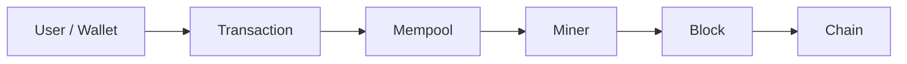

# What is Bitcoin?

Bitcoin is a decentralized digital currency and payment system that operates without a central authority or intermediary. It was created in 2009 by an anonymous person or group using the pseudonym [Satoshi Nakamoto](/docs/history/people#satoshi-nakamoto), who first described the system in the [Bitcoin whitepaper](/whitepaper) published on October 31, 2008.

While this definition captures Bitcoin's technical foundation, Bitcoin is multifaceted. As you go down the Bitcoin rabbit hole, you'll discover that Bitcoin represents something unprecedented in human history. Bitcoin has a way of enticing you to learn more about related topics: economics, game theory, cryptography, monetary history, and the nature of trust itself.

Stay curious and keep learning 🧡

---

**Bitcoin** (capitalized) refers to the protocol, network, and system.  
**bitcoin** (lowercase) or **BTC** refers to the currency unit.

> **Note:** Throughout this documentation, "Bitcoin" refers specifically to **BTC (Bitcoin Core)**, the original and longest-running Bitcoin network. While other networks like Bitcoin Cash (BCH) and Bitcoin SV (BSV) share Bitcoin's history up to their respective fork points, they are separate networks with different consensus rules. This documentation focuses exclusively on Bitcoin (BTC).  
>   
> **Be aware:** The website bitcoin.com promotes Bitcoin Cash (BCH), not Bitcoin (BTC). Despite its name, it is not the official Bitcoin website and does not represent the Bitcoin (BTC) network.

---

## Core Components

Bitcoin consists of several key components that work together to create a decentralized monetary system:

**Blockchain:** The [distributed ledger](/docs/fundamentals/blockchain) that records all transactions in cryptographically linked blocks, creating an immutable history that all network participants can verify.

**Cryptography:** The mathematical foundation of Bitcoin. [Elliptic curve cryptography](/docs/bitcoin/cryptography) enables unforgeable digital signatures, while hash functions provide data integrity and mining security.

**Consensus Mechanism:** Bitcoin's [consensus mechanism](/docs/bitcoin/consensus) allows thousands of nodes worldwide to agree on a single transaction history without central coordination, using proof-of-work and economic incentives.

**Script:** [Bitcoin Script](/docs/bitcoin/script) is a simple programming language that defines spending conditions, enabling features like multi-signature wallets and time-locked transactions.

**OP Codes:** The [instruction set](/docs/bitcoin/op-codes) that powers Bitcoin Script, with each opcode performing specific operations for transaction validation and program execution.

**Block Structure:** [Blocks](/docs/bitcoin/blocks) are the fundamental units of Bitcoin's ledger, organizing transactions and enabling efficient verification through Merkle trees.

**Economic Rules:** The [subsidy equation](/docs/bitcoin/subsidy) mathematically guarantees Bitcoin's fixed supply, creating a predictable monetary policy that approaches 21 million coins.

| Component | Purpose |
|-----------|---------|
| [Blockchain](/docs/fundamentals/blockchain) | Distributed ledger; cryptographically linked blocks; immutable, verifiable history |
| [Cryptography](/docs/bitcoin/cryptography) | Digital signatures, hashes; ownership and integrity without trust |
| [Consensus](/docs/bitcoin/consensus) | Nodes agree on transaction history via proof-of-work; no central coordinator |
| [Script](/docs/bitcoin/script) | Spending conditions; multisig, timelocks, smart contracts |
| [OP Codes](/docs/bitcoin/op-codes) | Instruction set for Script; validation and program execution |
| [Blocks](/docs/bitcoin/blocks) | Units of the ledger; Merkle trees for efficient verification |
| [Subsidy](/docs/bitcoin/subsidy) | Fixed supply; predictable monetary policy toward 21 million |

---

## How Bitcoin works

At a high level: you hold [private keys](/docs/glossary#private-key) that control [addresses](/docs/glossary#address). To send bitcoin you build a [transaction](/docs/glossary#transaction) that spends [UTXOs](/docs/glossary#utxo-unspent-transaction-output) and creates new outputs. The transaction is broadcast to the network and sits in the [mempool](/docs/glossary#mempool) until [miners](/docs/glossary#miner) include it in a [block](/docs/glossary#block). Each new block adds a [confirmation](/docs/glossary#confirmation); more confirmations mean stronger finality. The [blockchain](/docs/fundamentals/blockchain) is the shared ledger that everyone can verify.

---

## First steps

**Choosing a wallet:** Pick a [wallet](/docs/wallets) that fits your use case (mobile, desktop, or hardware). Non-custodial wallets give you full control; custodial options (e.g. exchanges) hold keys for you and are easier to start with but less secure. See [Trust Model](/docs/fundamentals/trust-model) for the trade-offs.

**Getting bitcoin:** You can buy bitcoin on [exchanges](/docs/glossary#exchange) (often after identity checks) or at some ATMs. Withdraw to your own wallet for self-custody.

**Sending a transaction:** Create a payment in your wallet (recipient address and amount). The wallet estimates [fees](/docs/bitcoin/transaction-fees); higher fees usually mean faster inclusion. After you broadcast, the transaction receives confirmations as new blocks are mined. See [Transaction Lifecycle](/docs/bitcoin/transaction-lifecycle) and [Denominations](/docs/fundamentals/denominations) for amounts and units.

**Security basics:** Back up your [seed phrase](/docs/glossary#seed-phrase) or private keys and keep backups offline and private. Prefer self-custody when you can; if you use an exchange, withdraw to your own wallet for larger amounts. Beware of phishing and fake sites. For more, see [Wallet Security & Self-Custody](/docs/investment/wallet-security).

---

## Technical Innovation

### Proof-of-Work
- Secures the network through computational work
- Prevents [double-spending](/docs/glossary#double-spend)
- Reaches [consensus](/docs/glossary#consensus) without central authority
- Requires significant computational resources

### UTXO Model
- [Unspent Transaction Outputs](/docs/fundamentals/utxos) - The fundamental accounting model of Bitcoin
- Each transaction consumes and creates UTXOs
- Enables parallel transaction processing
- Clear ownership model

### Merkle Trees
- Efficient transaction verification
- Compact block structure
- Enables [SPV](/docs/glossary#spv-simplified-payment-verification) (Simplified Payment Verification)
- Cryptographic integrity

---

## The Many Faces of Bitcoin

### The New Element

Bitcoin represents something unprecedented: **Element Zero**, consisting only of energy.

**Proof of Work** is the bridge between the physical and digital worlds. Real energy (electricity, computational power, thermodynamic work) is consumed to maintain the digital scarcity of bitcoin. This is not a bug, but a feature. The energy expenditure is what gives bitcoin its unforgeable costliness, anchoring digital value to physical reality in a way no other digital asset can claim.

### The Currency

Bitcoin is **deflationary money with absolute scarcity**. Only 21 million bitcoin will ever exist, a fixed supply that cannot be inflated, diluted, or manipulated.

This scarcity will produce conditions of human interaction never before seen in monetary history:
- **Abundance through deflation**: As productivity increases, the value of saved bitcoin grows
- **Long-term thinking**: Sound money encourages saving and investment over consumption
- **True price discovery**: Without monetary manipulation, markets can function honestly

### The Commodity

Bitcoin can **store value across time**. Like gold, but better:
- Infinitely divisible
- Perfectly portable
- Easily verifiable
- Impossible to counterfeit
- Resistant to confiscation

### The Protocol

Bitcoin is a protocol that allows for **free and instant transfers of value** across the entire planet.

- **Trustless**: No need to trust any third party
- **Permissionless**: Anyone can participate without asking permission
- **Borderless**: Works the same everywhere on Earth

**Bitcoin is a trust machine.** It replaces trust in institutions with mathematical verification.

### The Network

**Miners**: Transform energy into bitcoin. They compete to solve cryptographic puzzles, securing the network and processing transactions. In doing so, they convert raw energy into the most secure monetary network ever created.

**Nodes**: Verify that the network rules were followed. Every node is a server on the Bitcoin network, independently validating every transaction and block. This distributed verification is what makes Bitcoin truly decentralized.

### The Idea

At its core, Bitcoin is nothing but a **meme**, an idea that replicates itself through human minds.

Bitcoin embodies the idea that a **fixed set of rules can exist** around which entire societies can be built, rules that no government, corporation, or individual can change.

It unlocks the **true power of human cooperation**: voluntary exchange based on mutually agreed rules that cannot be violated.

Once the concept of sound, digital, decentralized money enters someone's mind, it cannot be unseen. It spreads from person to person, generation to generation, border to border.

See [Bitcoin, the Meme](/docs/fundamentals/bitcoin-meme) for how these ideas spread and the cultural memes that have emerged.

### The Threat

Bitcoin is under **constant attack** from the most sophisticated entities on this planet:
- Intelligence agencies (NSA, KGB, Mossad, and countless others)
- Central banks protecting their monopoly on money
- Governments seeking to maintain financial control
- Hackers seeking the largest bug bounty in history

**And it has never been hacked.**

The network has operated continuously since January 3, 2009, securing hundreds of billions of dollars in value. The only theoretical attack (a 51% attack) would require controlling more computational power than all other miners combined, a feat that grows more impossible as the network expands.

Bitcoin cannot be hacked. It can only be adopted.

---

## Explore Bitcoin Fundamentals

Dive deeper into the core concepts that make Bitcoin work:

- [Problems Bitcoin Solved](/docs/fundamentals/problems) - The fundamental challenges Bitcoin addresses
- [Cypherpunk Philosophy](/docs/fundamentals/cypherpunk-philosophy) - The philosophical foundation behind Bitcoin's design
- [The Blockchain](/docs/fundamentals/blockchain) - How blocks are cryptographically linked to create an immutable chain
- [Bitcoin as Timechain](/docs/fundamentals/timechain) - How Bitcoin solves timing in decentralized networks
- [UTXO Model](/docs/fundamentals/utxos) - How Bitcoin tracks ownership through unspent transaction outputs
- [Decentralization](/docs/fundamentals/decentralization) - Distribution of control across the network
- [Trust Model](/docs/fundamentals/trust-model) - How Bitcoin minimizes trust requirements
- [Monetary Properties](/docs/fundamentals/monetary-properties) - The economic characteristics of Bitcoin
- [Denominations](/docs/fundamentals/denominations) - Bitcoin units from satoshis to BTC and how to convert between them
- [Incentive Structure](/docs/fundamentals/incentives) - How economic incentives shape Bitcoin's security
- [Game Theory](/docs/fundamentals/game-theory) - How strategic decision-making secures the Bitcoin network
- [Bitcoin, the Meme](/docs/fundamentals/bitcoin-meme) - How Bitcoin functions as a powerful idea that spreads through culture
