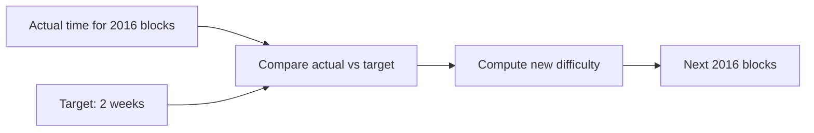

# Difficulty Adjustment

Bitcoin's difficulty adjustment is a critical mechanism that maintains the network's target [block time](/docs/glossary#block-time) of approximately 10 minutes. Every 2016 blocks (~2 weeks), the network automatically adjusts the mining difficulty based on the actual time it took to mine the previous 2016 blocks.

## How Difficulty Adjustment Works

### Adjustment Formula

The difficulty adjusts every **2016 blocks** (approximately every 2 weeks) using the formula:

```
New Difficulty = Old Difficulty × (Target Time / Actual Time)
```

Where:
- **Target Time**: 2016 blocks × 10 minutes = 20,160 minutes (2 weeks)
- **Actual Time**: Time it took to mine the previous 2016 blocks

### Adjustment Rules

- **If blocks were mined too fast** (less than 2 weeks): Difficulty increases
- **If blocks were mined too slow** (more than 2 weeks): Difficulty decreases
- **Maximum adjustment**: ±4x per period (prevents extreme swings)



---

## Why Difficulty Adjustment Exists

### Maintaining Block Time

- **Target**: ~10 minutes per block
- **Purpose**: Predictable block creation rate
- **Benefit**: Consistent transaction confirmation times

### Network Security

- **Hash Rate Changes**: Network [hash rate](/docs/glossary#hash-rate) fluctuates
- **Hardware Improvements**: New [ASICs](/docs/glossary#asic-application-specific-integrated-circuit) increase network hash rate
- **Miner Participation**: Miners join/leave the network
- **Adaptation**: Difficulty adjusts to maintain security

### Economic Stability

- **Predictable Rewards**: Miners can estimate earnings
- **Consistent Block Times**: Users know confirmation times
- **Network Health**: Prevents too-fast or too-slow block creation

---

## Historical Difficulty Adjustments

### Early Bitcoin (2009-2012)
- **Difficulty**: Very low (could mine with CPU)
- **Adjustments**: Frequent large increases as hash rate grew
- **Network**: Small, growing hash rate

### ASIC Era (2013-Present)
- **Difficulty**: Rapidly increasing
- **Adjustments**: Regular increases as ASICs improved
- **Network**: Massive hash rate growth

### Current State (2024)
- **Difficulty**: ~700+ trillion (extremely high)
- **Adjustments**: More stable, smaller percentage changes
- **Network**: Mature, large hash rate

---

## Difficulty Metrics

### Current Network Stats
- **Block Time**: Maintained at ~10 minutes average
- **Hash Rate**: ~700 EH/s (exahashes per second)
- **Difficulty**: Adjusts every 2016 blocks
- **Adjustment Frequency**: Approximately every 2 weeks

### Target (difficulty encoding)

The [difficulty target](/docs/glossary#difficulty-target) is stored in the block header in the **nBits** (or "bits") field, a compact 4-byte representation. Miners hash the block header; the resulting hash must be numerically below the target for the block to be valid. A lower target means higher difficulty (fewer valid hashes); a higher target means lower difficulty. The target is decoded from nBits into a 256-bit value for comparison. See [Block Header](/docs/glossary#block-header) for the six header fields.

### Difficulty Calculation

The difficulty target is calculated from the block header:
- **Target Hash**: Maximum hash value that's considered valid
- **Lower Target**: Higher difficulty (harder to find valid hash)
- **Higher Target**: Lower difficulty (easier to find valid hash)

---

## Impact on Miners

### Hash Rate Changes

When network hash rate increases:
- **Difficulty increases** in next adjustment
- **Same hardware** produces fewer valid hashes
- **Mining becomes harder** for all miners

When network hash rate decreases:
- **Difficulty decreases** in next adjustment
- **Same hardware** produces more valid hashes
- **Mining becomes easier** for all miners

### Profitability Considerations

- **Difficulty increases**: Reduce profitability (unless hash rate increases)
- **Difficulty decreases**: Increase profitability (if hash rate stays same)
- **Long-term trend**: Difficulty generally increases over time

---

## Technical Details

### [Block Header](/docs/glossary#block-header) Fields

The difficulty is encoded in the block header's `nBits` field:
- **Compact representation**: 32-bit value
- **Target calculation**: Converts nBits to full 256-bit [difficulty target](/docs/glossary#difficulty-target)
- **Validation**: Block hash must be less than target

### Adjustment Algorithm

:::code-group
```rust
/// Simplified difficulty adjustment
///
/// # Arguments
///
/// * `old_difficulty` - Previous difficulty value
/// * `actual_time` - Time in minutes to mine 2016 blocks
/// * `target_time` - Target time (default: 20160 minutes)
///
/// # Returns
///
/// New difficulty value
fn adjust_difficulty(old_difficulty: f64, actual_time: f64, target_time: f64) -> f64 {
    // Default target_time: 2016 blocks × 10 minutes = 20,160 minutes
    let target_time = if target_time == 0.0 { 20160.0 } else { target_time };
    
    let mut ratio = target_time / actual_time;
    
    // Limit adjustment to ±4x
    ratio = ratio.clamp(0.25, 4.0);
    
    old_difficulty * ratio
}

fn main() {
    // Example: blocks mined in 18,000 minutes (faster than target)
    let new_diff = adjust_difficulty(100_000.0, 18_000.0, 20_160.0);
    println!("New difficulty: {}", new_diff); // ~112,000
}
```

```python
def adjust_difficulty(old_difficulty, actual_time, target_time=20160):
    """
    Simplified difficulty adjustment.
    
    Args:
        old_difficulty: Previous difficulty value
        actual_time: Time in minutes to mine 2016 blocks
        target_time: Target time (2016 blocks × 10 minutes = 20,160 minutes)
    
    Returns:
        New difficulty value
    """
    ratio = target_time / actual_time
    
    # Limit adjustment to ±4x
    ratio = max(0.25, min(4.0, ratio))
    
    new_difficulty = old_difficulty * ratio
    return new_difficulty
```

```cpp
#include <algorithm>
#include <iostream>

/**
 * Simplified difficulty adjustment.
 * 
 * @param old_difficulty Previous difficulty value
 * @param actual_time Time in minutes to mine 2016 blocks
 * @param target_time Target time (2016 blocks × 10 minutes = 20,160 minutes)
 * @return New difficulty value
 */
double adjust_difficulty(double old_difficulty, double actual_time, double target_time = 20160.0) {
    double ratio = target_time / actual_time;
    
    // Limit adjustment to ±4x
    ratio = std::clamp(ratio, 0.25, 4.0);
    
    double new_difficulty = old_difficulty * ratio;
    return new_difficulty;
}

int main() {
    // Example: blocks mined in 18,000 minutes (faster than target)
    double new_diff = adjust_difficulty(100000.0, 18000.0);
    std::cout << "New difficulty: " << new_diff << std::endl; // ~112,000
    return 0;
}
```

```go
package main

import (
	"fmt"
	"math"
)

// AdjustDifficulty performs simplified difficulty adjustment
func AdjustDifficulty(oldDifficulty float64, actualTime float64, targetTime float64) float64 {
	if targetTime == 0 {
		targetTime = 20160.0 // Default: 2016 blocks × 10 minutes
	}
	
	ratio := targetTime / actualTime
	
	// Limit adjustment to ±4x
	ratio = math.Max(0.25, math.Min(4.0, ratio))
	
	newDifficulty := oldDifficulty * ratio
	return newDifficulty
}

func main() {
	// Example: blocks mined in 18,000 minutes (faster than target)
	newDiff := AdjustDifficulty(100_000.0, 18_000.0, 20_160.0)
	fmt.Printf("New difficulty: %.0f\n", newDiff) // ~112,000
}
```

```javascript
/**
 * Simplified difficulty adjustment.
 * 
 * @param {number} oldDifficulty - Previous difficulty value
 * @param {number} actualTime - Time in minutes to mine 2016 blocks
 * @param {number} targetTime - Target time (default: 20160 minutes)
 * @returns {number} New difficulty value
 */
function adjustDifficulty(oldDifficulty, actualTime, targetTime = 20160) {
    let ratio = targetTime / actualTime;
    
    // Limit adjustment to ±4x
    ratio = Math.max(0.25, Math.min(4.0, ratio));
    
    const newDifficulty = oldDifficulty * ratio;
    return newDifficulty;
}

// Example: blocks mined in 18,000 minutes (faster than target)
const newDiff = adjustDifficulty(100_000, 18_000);
console.log(`New difficulty: ${newDiff}`); // ~112,000
```
:::

### Validation

- **Every 2016 blocks**: Check if adjustment needed
- **Block height**: Must be multiple of 2016
- **Genesis block**: Block 0, no adjustment
- **First adjustment**: Block 2016

---

## Related Topics

- [Proof-of-Work Mechanism](/docs/mining/proof-of-work) - How the mining algorithm works
- [Mining Economics](/docs/mining/economics) - How difficulty affects profitability
- [Bitcoin Mining](/docs/mining) - General mining concepts
